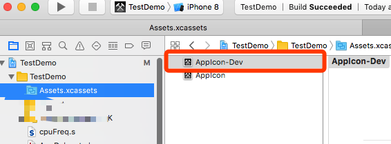

# Xcode Script Tools

## icon_mark

Shell Script tool of Xcode.

Make App Dev-Info more clearer and straight.
Info: 

- __Git-Info__ (e.g. ver-hash,branch)
- Xcode __Project-Info__ (e.g. short-version,build-number)
 
Add text of above info to the App-Icon image as a watermark.


### Featrue 

- [x] Add infomation(git,project..) to App-Icon image.
- [x] Make a new 'AppIcon-Dev.appiconset' directory. You can select.

### Requirement

_test passed_

- MacOSX 10.x+ 
- Xcode 9+
- [ImageMagick](http://www.imagemagick.org/)

### Dependent on

#### Install

If you not install `brew`, flow step below to install(or ignore):

__[Homebrew](https://brew.sh/)__

```shell 
/usr/bin/ruby -e "$(curl -fsSL https://raw.githubusercontent.com/Homebrew/install/master/install)"
```

---

__[ImageMagick](http://www.imagemagick.org/)__ 

```shell
brew install imagemagick 
```

### Usage

#### 0x00:

Put the script whatever you want.

```
.
├── icon_mark
└── lib
    └── dev_kit.sh
```


#### 0x01:

Open Xcode Project.

`Xcode Project` -> `Target` -> `Build Phases` -> `Add 'Run Script'` -> `Edit to run script file`


__Note:__ Script path(Absolute path recommend) : `<Dir-Path-To>/icon_mark`

Please make sure that the `lib` directory should be in the same directory as `icon_mark` file.

#### 0x02:

1. First `Build` your project; if success, `AppIcon-Dev` was generated in the `.xcassets` folder.
2.  Set project -> target -> General -> App Icons and Launch Images -> App Icons Source to `AppIcon-Dev` 
3. `Run` Again. The icon of App will right setup.





__Important__ 

- Make sure your project has the `.appiconset` folder which has a `size:1024x1024` of App icon image in it.
- The marked app icon only created in `Debug` CONFIGURATION.


### Reference

- [iconVersion](https://github.com/krzysztofzablocki/IconOverlaying/blob/master/Scripts/iconVersioning.sh)

### LICENSE

__MIT__


